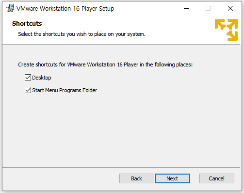

# 웹 개발 포트폴리오
## 후기 웹사이트
IT 기기, 생활용품 등 본인의 관심사에 관련된 제품의 비평을 올리는 웹사이트입니다.   
관심 있는 제품을 사기 전에 그 제품에 대한 평가를 참고하여 좀 더 신중하게 구입할 수 있게 할 수 있음.
## 주요 기능
+ 제품 검색 : 검색하면 그 제품에 대한 크기, 가격 등 정보가 나옴
+ 로그인 기능 : 회원가입 하고 로그인
+ 댓글 기능 : 작성자가 댓글을 작성하고 저장함. 본인의 것을 직접 삭제도 가능하도록 함.
+ 필터링 처리 : 욕설 같은 지정된 금지어를 자동으로 필터링 처리하기
+ 댓글 관리 : 사이트 관리자가 제품에 관한 비평이랑 전혀 관련 없는 댓글을 삭제할 수 있도록 함
## 사용할 기술
자바 스크립트
# 1주차
웹 서버를 세팅하기 위해 VMWare이랑 Ubuntu를 설치했습니다.  
VMWare는 www.vmware.com 로 들어가서 window버전을 다운로드 했습니다.  
  

바로 next  

  

동의 체크 후 Next  

  

바로 next  

  

2개 다 체크 해제 후 next  

  

2개 다 체크 하고 next  

  

인스톨  

  

이거 생각보다 오래 걸렸습니다.  

  

설치 완료  

  

1번째 체크 후 continue  

  

finish  

  
