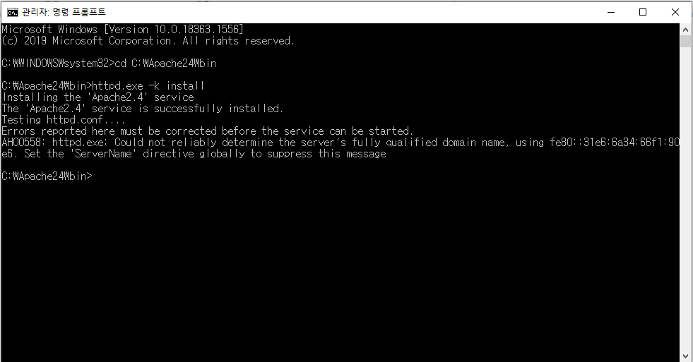
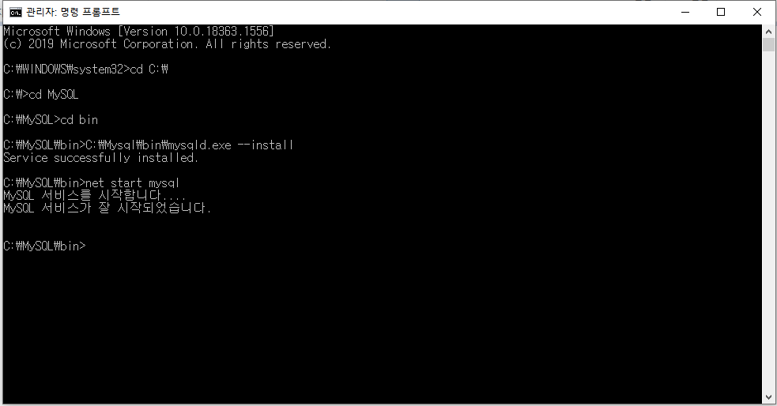
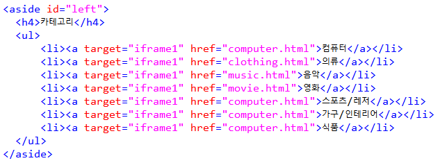
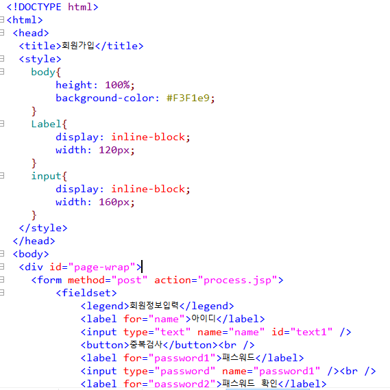
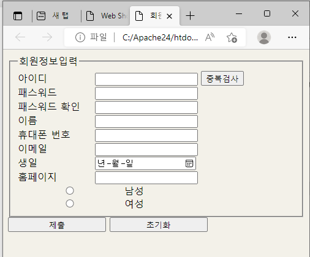
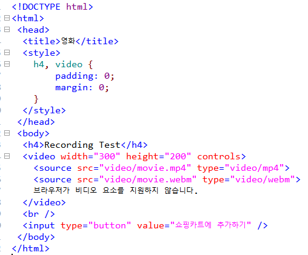

# 웹 개발 포트폴리오
## 후기 웹사이트
IT 기기, 생활용품 등 본인의 관심사에 관련된 제품의 비평을 올리는 웹사이트입니다.   
관심 있는 제품을 사기 전에 그 제품에 대한 평가를 참고하여 좀 더 신중하게 구입할 수 있게 할 수 있음.
## 주요 기능
+ 제품 검색 : 검색하면 그 제품에 대한 크기, 가격 등 정보가 나옴
+ 로그인 기능 : 회원가입 하고 로그인
+ 댓글 기능 : 작성자가 댓글을 작성하고 저장함. 본인의 것을 직접 삭제도 가능하도록 함.
+ 필터링 처리 : 욕설 같은 지정된 금지어를 자동으로 필터링 처리하기
+ 댓글 관리 : 사이트 관리자가 제품에 관한 비평이랑 전혀 관련 없는 댓글을 삭제할 수 있도록 함
## 사용할 기술
자바 스크립트
# 1주차
웹 서버를 세팅하기 위해 운영체제를 담당하는 VMWare이랑 Ubuntu를 설치했습니다.  
VMWare는 www.vmware.com 로 들어가서 window버전을 다운로드 했습니다.  
  

바로 next  

  

동의 체크 후 Next  

  

바로 next  

  

2개 다 체크 해제 후 next  

  

2개 다 체크 하고 next  

  

인스톨  

  

이거 생각보다 오래 걸렸습니다.  

  

설치 완료  

  

1번째 체크 후 continue  

  

finish  

  

VMware 실행된 모습입니다.

  

Ubuntu는 https://ubuntu.com/ 로 들어가서 Download -> Ubuntu Desktop  

  
  
  

다운 받았으면 VMware를 실행하고 "Create a New Virtual Machine"를 클릭합니다.  

  

"Installer disc image file (iso)"를 체크하고 Browse를 클릭해서 우분투 이미지 파일을 찾은 후에 next.  

  

우분투에서 사용할 계정 정보를 입력하고 next(나중에 이 계정으로 로그인을 할 예정입니다)  

  

바로 next

  

저는 용량을 20GB로 설정하고  
Store virtual disk as a single file: VMDK 파일을 단일 파일로 생성  
Split virtual disk into multiple files: VMDK 파일을 2GB로 분할하여 생성  
둘 중에 저는 첫번째를 선택하고 next했습니다.  

  

Customize Hardware를 클릭하면 메모리 설정을 할 수 있습니다. 설정 다하고 finish  

  

  

"Play virtual machine" 버튼을 클릭하여 가상 머신을 실행해 줍니다.  
실행완료하는데 1시간은 가볍게 넘을 걸로 기억합니다.  
CPU때문인지 진행 중에 유트브나 게임을 키면 렉이 심하게 걸려서 아무것도 못하고 기다렸습니다.  

  

설치가 완료되면 이전에 만들어둔 계정으로 로그인 할 수 있습니다.  

  

잠깐 자리 비운 사이에 갑자기 실행 화면이 검은 색으로 변해서 오류가 발생했나 싶어서 당황했지만  

  

다행스럽게도 그냥 화면 클릭하면 풀립니다. 이게 일정시간동안 가만히 두면 화면 잠금처리 되는 것 같습니다.  

  

이제 로그인을 하면  

  

우분투 설치 완료된 모습을 볼 수 있습니다.  

  

## 현재 겪고있는 문제점
가상환경을 담당하는 Docker를 설치해야 하는데  
https://blog.dalso.org/linux/ubuntu-20-04-lts/13118  
cmd 같은 곳에 코드를 입력해야 하는데 검은 화면이 어떤 프로그램인지 몰라서 설치를 못하는 중입니다.  
# 2주차  
저번에 설치했던 vmware이랑 우분투는 용량을 많이 요구하면서 버퍼링이 너무 걸려서  
포기하고 윈도우10 웹서버를 구축하기 위해 APM(Apache + PHP + Mysql)을 설치했습니다.  

Apache는 https://www.apachelounge.com/download/ 로 들어가서 압축파일을 다운받고  

  

압축을 풀고 Apache24를 C:\로 옮기고 conf로 들어가서 http.conf를 메모장으로 연결해서  

  

ServerRoot가  C:/Apache24로 되어있는지 확인해주고  

  

Listen이 80으로 설정되어 있는지 확인해 줍니다.  

  

ServerName은 반드시 바꿀 필요는 없습니다.  

  

이 경로로 들어가서 httpd.exe파일을 실행시키기 위해 콘솔에서 실행해야 합니다.

  

cmd를 관리자 권한으로 실행해서 이렇게 입력하면 됩니다. 이 화면은 딱히 큰 이상은 없었습니다.  

  

보안 경고가 뜨면 '액세스 허용'을 누르면 됩니다.  

  

이제 아파치모니터를 실행하면  

  

화면 오른쪽 아래의 아이콘을 마우스 우클릭하고 open apache monitor를 클릭하고 start를 누르면  

  

이렇게 바뀝니다.  

  

웹 브라우저를 실행하여 http://localhost/ 로 접속하여 아래 페이지가 뜨면 아파치 웹서버 설치가 완료되었다는 것을 알 수 있습니다.  

  

PHP는 https://windows.php.net/download/ 로 들어가서 Thread Safe Zip파일을 다운 받았습니다.  

  

C드라이브에 'PHP'라는 이름의 파일을 만들고 나서 압축파일을 해제했습니다.  

  

php.ini-production 라는 파일을 php.ini 로 변경해줍니다.  

  

변경된 그 파일을 메모장으로 열어서 ;extension_dir = "./" 를 다음과 같이 수정했습니다.  

1. 앞에 세미콜론 제거하기  
2. 큰 따옴표 안을 "PHP 설치 경로/ext" 다음과 같이 수정하기  

저는 아래와 같이 수정하였습니다.  

  

  

Apache와 PHP 연동은 아파치 설정파일에서 설정합니다. 아래 경로의 Apache 설정파일을 메모장으로 실행해서  
C:\Apache24\conf\httpd.conf  
<IfModule dir_module>과 밑에 있는 </IfModule> 사이에 DirectoryIndex index.html을 다음과 같이 수정했습니다.  

  

  

그리고 맨 밑에 다음과 같이 추가했습니다.  

  

cmd를 관리자 권한으로 실행해서 다음과 같이 입력해서 PHP 연동 되었습니다.  

  

이제 PHP 연동이 잘 되었는지 테스트 해보겠습니다.  
Apache 웹문서 저장공간(C:\apache24\htdocs)에 phpinfo.php 라는 파일을 만들고 메모장으로 다음과 같이 내용을 입력합니다.  

  

파일을 저장하고 웹브라우저에 localhost/phpinfo.php를 입력합니다.
다음과 같이 PHP 설치정보가 나온다면, 정상적으로 설치가 완료된 것을 알 수 있습니다.  

  

MYSQL는 https://dev.mysql.com/downloads/mysql/ 로 들어가서 Windows (x86, 64-bit), ZIP Archive를 다운 받았습니다.  

  

다운로드를 누르면 이런 페이지가 나올텐데 No thanks, just start my download를 선택합니다.

  

다운로드 받은 MYSQL ZIP 파일을 압축해제하고  
mysql-8.0.25-winx64 이라는 파일명을 MySQL로 바꿔서 C:\로 옮깁니다.  
MYSQL 기본 설정값을 세팅하기 위해서 MySQL로 들어가서 my.ini 라는 파일을 만들고 메모장으로 다음과 같이 내용을 입력했습니다.  

  

여기서 저장할 때 다른 이름으로 저장버튼을 누르고 파일 형식(T)을 모든 파일로 설정하고 인코딩(E)을 ANSI로 설정하고 저장합니다.  

  

이제 MYSQL을 구동하기 위한 기본 DB를 생성하기 위해서 CMD를 관리자 권한으로 실행하고 아래 명령어를 순서대로 입력했습니다.  

  

실행이 완료되면 C:\MySQL 폴더 안에 data라는 폴더가 생성됩니다.  
data로 들어가면 .err로 끝나는 파일을 고르고  

  

메모장으로 열어서 localhost: 옆에 임시 비밀번호가 있습니다. 이걸 기억해줍니다.  

  

MYSQL 윈도우 서비스 등록을 위해 CMD를 관리자 권한으로 실행하고 아래 명령어를 순서대로 입력했습니다.  

  

MYSQL 접속을 위해 CMD를 관리자 권한으로 실행하고 아래 명령어를 순서대로 입력했습니다.  
특히 Enter password: 옆에 아까 기억했던 임시 비밀번호를 입력합니다.  

  

현재는 임시로 생성된 root 비밀번호를 사용하여 MYSQL에 접속한 것이기 때문에  
비밀번호를 변경하기 위해 다음과 같이 입력했습니다. 저는 12345로 변경했습니다.  

  

이제 MYSQL DB를 만들기 위해 먼저 다음과 같이 입력했습니다.  

  

현재 4개의 DB가 생성되어 있습니다. 다음과 같이 입력하여 "test"라는 DB를 만들어보겠습니다.  

  

이번엔 다음과 같이 입력하여 "test"라는 DB를 삭제해보겠습니다.  

  

php에서 MySQL에 접근하기 위해 php 설정파일(C:\PHP\php.ini)을 메모장으로 열어서 수정했습니다.  
Ctrl + F로 extention을 검색해서 다음과 같이 2개를 찾아서 앞에 있는 ;을 지웠습니다.  

  

CMD를 관리자 권한으로 실행하고 아래 명령어를 사용해 Apache를 재시작 해줍니다.  

  

이제 MYSQL과 PHP 연동 테스트를 위해서 C:\Apache24\htdocs 로 들어가서  
mysqltest.php 라는 파일을 만들고 메모장으로 열어서 다음과 같이 편집했습니다.(이 때, 파일 형식은 UTF-8로 저장해 줍니다.)  
$pass = 옆에는 변경했던 비밀번호를 입력합니다.  

  

이제 웹 브라우저로 http://localhost/mysqltest.php 을 입력하면 다음과 같이 나옵니다.  

  

이러면 MYSQL 설치가 성공한 것을 알 수 있습니다.  

저는 html, css, javascript 같은 언어들을 익히기 위해 2016년 1학년 때 구입했던 교재를 이용하기로 했고  

  

파일 작성할 때 메모장으로 하기는 귀찮아서 javascript, php 등 여려가지 파일을 만들어서 편집할 수 있는 EditPlus로 작성하기로 했습니다.  

  

제가 만들려는 웹사이트에서 반드시 필요한 회원가입이랑 관련된 예제 html 문서를 직접 작성해봤습니다.  

  

  

작성하고 보니까  사이에 CSS를 삽입할 수 있는 내부 스타일 시트로 적용한 것을 알 수 있습니다.  
그리고 C:\Apache24\htdocs 로 파일을 저장해서 웹 브라우저로 실행해보니까 이렇게 나타납니다.  

  

여기에 입력을 대충하고 '초기화'버튼을 누르면 입력했던 것들이 다 사라지고 '중복검사'랑 '제출'버튼을 누르면 이렇게 나타납니다.  

  

이런 경우가 발생한 이유가 제가 이벤트에 반응하는 동작을 구현하기 위한 자바스크립트를 아직 익히지 못했고  
웹 서버를 구축하는 APM외에 아직 더 설치해야 하는 프로그램이나 더 배워야 하는 언어가 있는 것 같다고 생각합니다.  
# 3~?주차  
일단 저는 책에 있는 내용을 직접 코딩하면서 html, css 같은 언어들을 천천히 익히기로 했습니다.  
책에 있는 웹 사이트 관련 내용중에 쇼핑물 사이트 제작하는 것이 있어서 이것을 따라해 보기로 했습니다.  

먼저 다음과 같은 html 문서와 css 문서를 작성하게 됩니다.  
index.html : WebShop의 홈 화면, 상품 카테고리, 로고, 로그인 등이 포함되어 있다.  
register.html : 회원 가입 화면. 다양한 HTML5 입력 양식을 이용해 본다.  
shopcart.html : 현재 쇼핑 카트에 들어 있는 상품을 보여준다.  
computer.html : 컴퓨터 상품을 보여주는 화면이다. index.html 화면 안에 포함된다.  
clothing.html : 의류 상품을 보여주는 화면이다. index.html 화면 안에 포함된다.  
music.html : 음악 파일을 판매하는 화면이다. index.html 화면 안에 포함된다.  
movie.html : 영화 파일을 판매하는 화면이다. index.html 화면 안에 포함된다.  
mystyle.css : index.html에 대한 스타일을 가지고 있는 파일이다.  

HTML문서의 구조를 그림으로 간단하게 나타내면  

  

이렇게 됩니다. 그리고 이것을 코드로 변환하면  

  

이런식으로 변환됩니다.  
index.html을 만들려고 했는데  

  

이미 같은 이름의 파일이 있어서 index1.html으로 만들었습니다.  

  

헤더 부분에서 img 이미지 요소가 있는데  
이미지 파일을 삽입할 때 index1.html이랑 같은 경로에 반드시 추가해야합니다.  

  

그러면 결과가 이렇게 나옵니다.  

  

다음은 네비게이션 메뉴 부분을 번호 없는 리스트 형식으로 작성했습니다.  

  

왼쪽 수직 메뉴 부분도 번호 없는 리스트 형식으로 작성했고 target은  
링크를 클릭하면 지정한 곳에 화면이 뜨게 하는 기능을 가지고 있습니다.  

  

참고로 밑에 computer.html 3개 연속으로 있는 것은 오타 아닙니다.  
책에 그대로 나왔습니다.  

섹션은 아까 target으로 지정한 곳이 바로 이 iframe입니다.  

  

오른쪽 수직 메뉴는 div태그로 쇼핑 카트의 현재 상태와 로그인 메뉴를 나누었습니다.  

  

바닥글은 단순히 저작권 정보만 작성했습니다.  

  

이것으로 index1.html 작성은 끝났고 다음은 register.html입니다.  
이건 저번에 제가 시험삼아 무작정으로 작성했는 회원가입 부분입니다.  
  
  
  
  
  
저번에도 설명한 적이 있지만 이 파일에 내부 스타일시트를 적용한 것을 알 수 있습니다.  
원래라면 jsp파일도 만들어서 입력받은 정보를 서버로 전송해야 하지만  
이번엔 html과 css에 중점을 두기로 했습니다.  
  
다음은 상품 정보 페이지인 computer.html입니다.  
여기는 div태그로 첫 번째 상품과 두 번째 상품 구역을 나누었습니다.  

  

다음은 음악 판매 페이지인 music.html입니다.  
여기는 images파일과 마찬가지로 같은 경로에 audio파일을 추가하면 되고  
mp3파일, opp파일 둘 다 만들 필요는 없고 mp3파일만으로도 작동을 합니다.  
재생, 일시정지, 소리 크기조절, 소리 속도조절까지 가능합니다.  

  

다음은 영화 판매 페이지인 movie.html입니다.  
여기도 images파일과 마찬가지로 적용하면 됩니다.  
그리고 스타일시트도 적용되었는데 패딩과 마진을 제거한 것입니다.  
참고로 내용과 테두리는 눈에 보이지만 패딩(내용과 테두리 사이의 간격)과 마진(테두리와 이웃하는 요소 사이의 간격)은 눈에 보이지 않습니다.  

  

영상은 그냥 테스트로 화면 녹화 몇 초를 한 것입니다.  

다음은 쇼핑 카트 페이지인 shopcart.html입니다.  
여기에 스타일시트를 적용했고 테이블 부분에서 input type="number" min="0" step="1" value="0"은 구매하고자 하는 수량을 나타내고  
size="6"은 입력 필드의 칸 수 입니다.  

  
  
  
