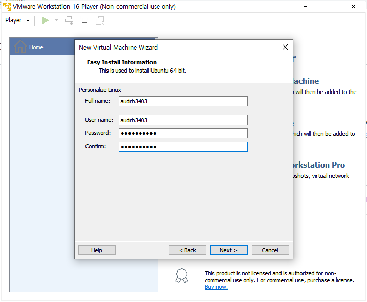

# 웹 개발 포트폴리오
## 후기 웹사이트
IT 기기, 생활용품 등 본인의 관심사에 관련된 제품의 비평을 올리는 웹사이트입니다.   
관심 있는 제품을 사기 전에 그 제품에 대한 평가를 참고하여 좀 더 신중하게 구입할 수 있게 할 수 있음.
## 주요 기능
+ 제품 검색 : 검색하면 그 제품에 대한 크기, 가격 등 정보가 나옴
+ 로그인 기능 : 회원가입 하고 로그인
+ 댓글 기능 : 작성자가 댓글을 작성하고 저장함. 본인의 것을 직접 삭제도 가능하도록 함.
+ 필터링 처리 : 욕설 같은 지정된 금지어를 자동으로 필터링 처리하기
+ 댓글 관리 : 사이트 관리자가 제품에 관한 비평이랑 전혀 관련 없는 댓글을 삭제할 수 있도록 함
## 사용할 기술
자바 스크립트
# 1주차
웹 서버를 세팅하기 위해 운영체제를 담당하는 VMWare이랑 Ubuntu를 설치했습니다.  
VMWare는 www.vmware.com 로 들어가서 window버전을 다운로드 했습니다.  
  

바로 next  

  

동의 체크 후 Next  

  

바로 next  

  

2개 다 체크 해제 후 next  

  

2개 다 체크 하고 next  

  

인스톨  

  

이거 생각보다 오래 걸렸습니다.  

  

설치 완료  

  

1번째 체크 후 continue  

  

finish  

  

VMware 실행된 모습입니다.

  

Ubuntu는 https://ubuntu.com/ 로 들어가서 Download -> Ubuntu Desktop  

  
  
  

다운 받았으면 VMware를 실행하고 "Create a New Virtual Machine"를 클릭합니다.  

  

"Installer disc image file (iso)"를 체크하고 Browse를 클릭해서 우분투 이미지 파일을 찾은 후에 next.  

  

우분투에서 사용할 계정 정보를 입력하고 next(나중에 이 계정으로 로그인을 할 예정입니다)  

  

바로 next

  

저는 용량을 20GB로 설정하고  
Store virtual disk as a single file: VMDK 파일을 단일 파일로 생성  
Split virtual disk into multiple files: VMDK 파일을 2GB로 분할하여 생성  
둘 중에 저는 첫번째를 선택하고 next했습니다.  

  

Customize Hardware를 클릭하면 메모리 설정을 할 수 있습니다. 설정 다하고 finish  

  

  

"Play virtual machine" 버튼을 클릭하여 가상 머신을 실행해 줍니다.  
실행완료하는데 1시간은 가볍게 넘을 걸로 기억합니다.  
CPU때문인지 진행 중에 유트브나 게임을 키면 렉이 심하게 걸려서 아무것도 못하고 기다렸습니다.  

  

설치가 완료되면 이전에 만들어둔 계정으로 로그인 할 수 있습니다.  

  

잠깐 자리 비운 사이에 갑자기 실행 화면이 검은 색으로 변해서 오류가 발생했나 싶어서 당황했지만  

  

다행스럽게도 그냥 화면 클릭하면 풀립니다. 이게 일정시간동안 가만히 두면 화면 잠금처리 되는 것 같습니다.  

  

이제 로그인을 하면  

  

우분투 설치 완료된 모습을 볼 수 있습니다.  

  

## 현재 겪고있는 문제점
가상환경을 담당하는 Docker를 설치해야 하는데  
https://blog.dalso.org/linux/ubuntu-20-04-lts/13118  
cmd 같은 곳에 코드를 입력해야 하는데 검은 화면이 어떤 프로그램인지 몰라서 설치를 못하는 중입니다.  
